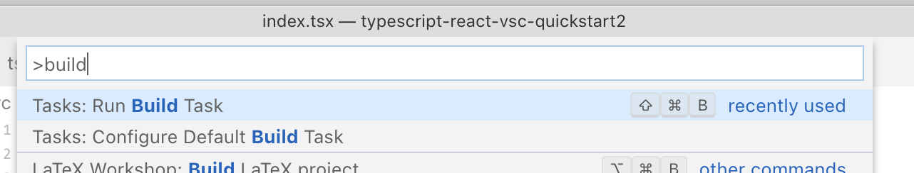
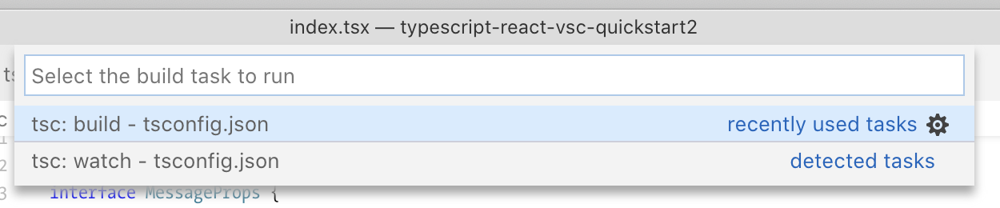
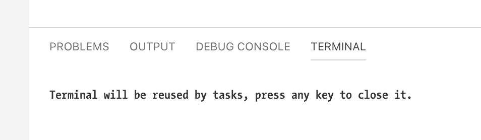

# TypeScript / React / Visual Studio Code Quick Start

Note to self for setting up a basic React/TypeScript project
with Visual Studio Code (VSC). It starts with the minimal project layout
and then goes through increasingly elaborate build setups, starting
with a basic option that uses VSC's built-in build support.

A lot of this is based on https://www.typescriptlang.org/docs/handbook/react-&-webpack.html

## Prerequisites

This assumes you have [node.js and NPM](https://nodejs.org/en/) installed.

# Basic Node Project setup

Create the project toplevel directory:

    mkdir typescript-react-vsc-quickstart
    cd typescript-react-vsc-quickstart
    mkdir -p {dist,src/components}

Initialize a node package for the project:

    % npm init
    package name: (typescript-react-vsc-quickstart2) 
    version: (1.0.0) 
    description: Fabulous Project
    entry point: (index.js) index.tsx
    test command: 
    git repository: 
    keywords: 
    author: Marc Liyanage
    license: (ISC) 
    [...]
    Is this OK? (yes) 

Install a few packages that provide TypeScript, React, and React TypeScript bindings, which
Visual Studio Code will use to provide intelligent suggestions etc.:

    npm install --save-dev typescript
    npm install --save react react-dom @types/react @types/react-dom

# TypeScript Configuration

Create a basic TypeScript configuration file as `tsconfig.json`:

    {
        "compilerOptions": {
            "outDir": "./dist/",
            "sourceMap": true,
            "noImplicitAny": true,
            "module": "commonjs",
            "jsx": "react"
        },
        "include": [
            "./src/**/*"
        ],
        "exclude": [
            "node_modules"
        ]
    }

# Option 1: Simple single-file project built with VSC

We'll start with a very simple setup suitable for quick and small projects
where all TypeScript code is in one file. This is probably not what you
want for larger projects but it requires less tooling.

In later sections we'll show more elaborate options that break up the code into smaller files and add the required tooling.

## HTML and TS files

Create a code and an HTML file to load the code. These examples use [Semantic UI](https://semantic-ui.com):

`src/index.tsx`

    'use strict';

    interface MessageProps {
        title: string;
    }

    class Message extends React.Component<MessageProps> {
        constructor(props: MessageProps) {
            super(props);
        }
        render() {
            return (
                

                    
{this.props.title}

                    
{this.props.children}

                

            );
        }
    }

    const tf = (
        <Message title="Hi">
            
Hello World

        </Message>
    )
    ReactDOM.render(tf, document.querySelector("#container"));

`index.html`

    <!doctype html>
    <html lang="en">
        <head>
            <title></title>
            <meta charset="utf-8">
            <link rel="stylesheet" href="https://cdn.jsdelivr.net/npm/semantic-ui@2.4.2/dist/semantic.min.css">
        </head>
        <body>
            

            
            
            
            

            
        </body>
    </html>

## Building with VSC

Ensure you have your project directory opened in VSC. Run VSC's "Run Build Task" command (⌘-⇧-B on the Mac).

In the menu that appears, choose the "tsc: build" command.

VSC's built-in Terminal should appear and after a few seconds you should get the "Terminal will be reused message".

The output should have been built into the `dist` directory:

    dist
    ├── index.js
    └── index.js.map

You can test it by opening the `index.html` file in your browser.

# Option 2: Build with webpack

This time, we'll split up the TS code and use [webpack](https://webpack.js.org) to bundle it all up.

## Install webpack

    npm install --save-dev webpack webpack-cli
    npm install --save-dev awesome-typescript-loader source-map-loader

## HTML and TS files

Create a component, a main code file, and a main HTML file to load it all. Some changes from the simpler, earlier version:

* The Message component is split out into its own tsx file
* It uses an import statement to load React components
* The index.tsx file also uses import statements to load the Message and React components
* The final JS file is called bundle.js, and index.html now refers to that

`src/components/Message.tsx`

    import * as React from "react";

    interface MessageProps {
        title: string;
    }

    export class Message extends React.Component<MessageProps> {
        constructor(props: MessageProps) {
            super(props);
        }
        render() {
            return (
                

                    
{this.props.title}

                    
{this.props.children}

                

            );
        }
    }

`src/index.tsx`

    import * as React from "react";
    import * as ReactDOM from "react-dom";
    import { Message } from "./components/Message";

    const tf = (
        <Message title="Hi">
            
Hello World

        </Message>
    )
    ReactDOM.render(tf, document.querySelector("#container"));

`index.html`

    <!doctype html>
    <html lang="en">
        <head>
            <title></title>
            <meta charset="utf-8">
            <link rel="stylesheet" href="https://cdn.jsdelivr.net/npm/semantic-ui@2.4.2/dist/semantic.min.css">
        </head>
        <body>
            

            
            
            
            

            
        </body>
    </html>

## Add a webpack Configuration File

Add a `webpack.config.js` file. This is based on https://www.typescriptlang.org/docs/handbook/react-&-webpack.html.

    module.exports = {
        mode: "development",
        entry: "./src/index.tsx",
        output: {
            filename: "bundle.js",
            path: __dirname + "/dist"
        },

        // Enable sourcemaps for debugging webpack's output.
        devtool: "source-map",

        resolve: {
            // Add '.ts' and '.tsx' as resolvable extensions.
            extensions: [".ts", ".tsx", ".js", ".json"]
        },

        module: {
            rules: [
                // All files with a '.ts' or '.tsx' extension will be handled by 'awesome-typescript-loader'.
                { test: /\.tsx?$/, loader: "awesome-typescript-loader" },

                // All output '.js' files will have any sourcemaps re-processed by 'source-map-loader'.
                { enforce: "pre", test: /\.js$/, loader: "source-map-loader" }
            ]
        },

        // When importing a module whose path matches one of the following, just
        // assume a corresponding global variable exists and use that instead.
        // This is important because it allows us to avoid bundling all of our
        // dependencies, which allows browsers to cache those libraries between builds.
        externals: {
            "react": "React",
            "react-dom": "ReactDOM"
        }
    };

## Add build and watch Commands

Add a "build" and "watch" command to the "scripts" section of your `package.json` file:

    "scripts": {
        "test": "echo \"Error: no test specified\" && exit 1",
        "build": "node_modules/.bin/webpack",
        "watch": "node_modules/.bin/webpack --watch"
    },

## Build the Project

You should now be able to build your project with:

    npm run build

The output will look something like:

    Version: webpack 4.29.6
    Time: 4123ms
    Built at: 03/05/2019 10:32:26 PM
            Asset      Size  Chunks             Chunk Names
        bundle.js  6.05 KiB    main  [emitted]  main
    bundle.js.map  5.03 KiB    main  [emitted]  main
    Entrypoint main = bundle.js bundle.js.map
    [./src/index.tsx] 335 bytes {main} [built]
    [react] external "React" 42 bytes {main} [built]
    [react-dom] external "ReactDOM" 42 bytes {main} [built]
        + 1 hidden module

Now open the main `index.html` file in your browser to test the code.

## Run watch mode

Webpack's watch mode can continuously rebuild your project whenever you save files in VSC.
To start watch mode, run:

    npm run watch

It should be pretty fast for incremental builds. Just reload the `index.html` file to see the changes. There is also a [dev-server](https://webpack.js.org/guides/development/#using-webpack-dev-server) to automate the reload.
